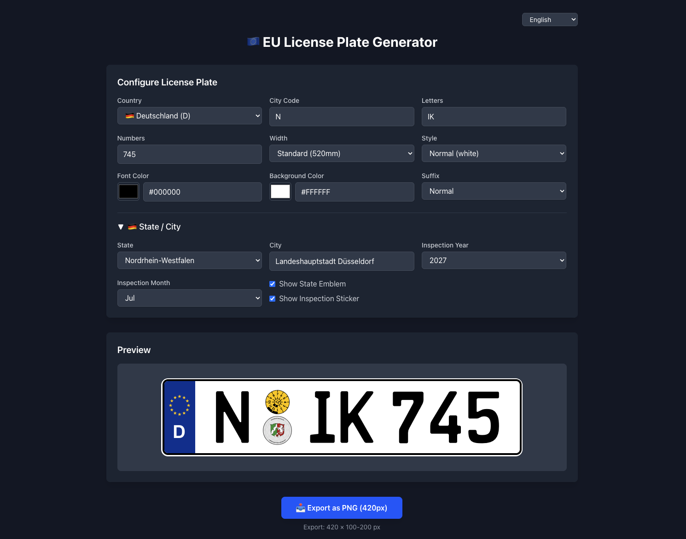

# EU License Plate Generator

A Next.js application for generating EU license plates as PNG images – optimized for Tesla's license plate display feature.

**🌐 [Try it live](https://license-plate.niklas.top)**



## Features

### 🌍 Multi-Country Support
- **27 EU Countries**: Generate plates for all EU member states
- **Country-specific styling**: Automatic colors/formats per country (yellow for NL/LU/CY, red text for Belgium, etc.)
- **Right-side bands**: Support for French, Italian, and Portuguese regional codes

### 🇩🇪 German Plates (Full Support)
- **State Plakette (Landeswappen)**: All 16 German states with authentic coat of arms
- **HU Plakette**: TÜV/HU inspection sticker with configurable year and month
- **Seasonal Plates (Saisonkennzeichen)**: Configure start/end months
- **Special Plates**: Electric (E), Historic (H), and Bundeswehr (Y) plates
- **City names**: Custom city text on the state plakette

### 🇦🇹 Austrian Plates
- All 9 Bundesländer with coat of arms
- Authentic red-stripe design

### 🇭🇺🇸🇰 Hungarian & Slovak Plates
- National coat of arms support

### 🎨 Customization Options
- **Plate Width**: Standard (520mm) or compact
- **Plate Styles**: Normal, 3D Black (matte/glossy), 3D Carbon (matte/glossy)
- **Custom Colors**: Configurable font and background colors
- **EuroPlate Font**: Authentic appearance with FE-Schrift typeface

### 📥 Export
- **PNG Export**: Optimized at 420×100-200px for Tesla's license plate display
- **URL State**: Shareable configuration via URL hash

## Technology Stack

- **Framework**: Next.js 16 with App Router
- **Language**: TypeScript
- **UI**: React 19 with Tailwind CSS 4
- **Screenshot**: modern-screenshot for cross-browser PNG export
- **Font**: EuroPlate TTF (FE-Schrift)

## Getting Started

### Prerequisites

- Node.js 18+ installed
- npm or yarn

### Installation

```bash
# Install dependencies
npm install

# Start development server
npm run dev
```

The app will be available at [http://localhost:3000](http://localhost:3000)

### Build for Production

```bash
npm run build
npm start
```

## License

[PolyForm Noncommercial 1.0.0](LICENSE) – Free for personal use, no commercial redistribution.
